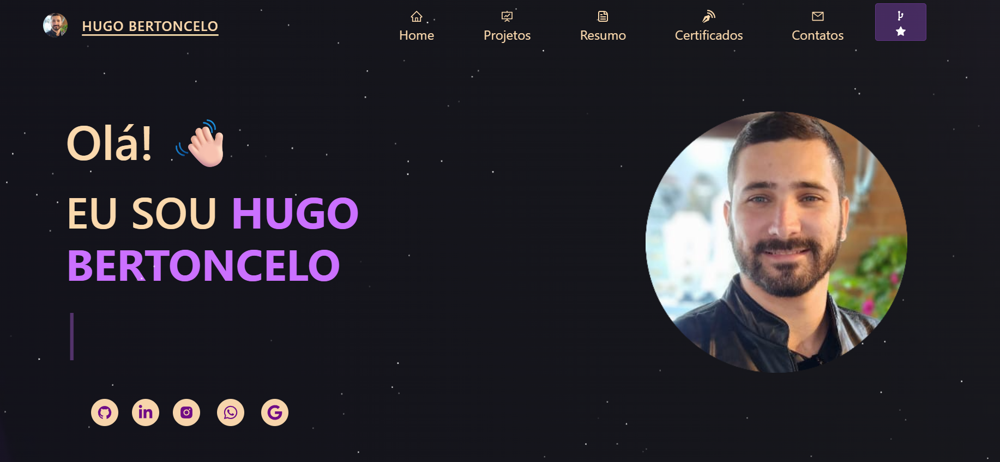

🌟 Hugo Bertoncelo – Portfolio em React 🚀

      

👋 Bem-vindo!

Esse é o meu portfólio pessoal, desenvolvido em React.js, com foco em design moderno, interatividade e responsividade.
O site reúne meus projetos, certificados e habilidades, com uma experiência fluida tanto no desktop quanto no mobile.

💡 “Cada linha de código é uma oportunidade para evoluir.”

✨ Principais Recursos
🎨 Design & Layout

Layout moderno e totalmente responsivo 📱

Efeito de partículas interativo ✨

Transições suaves e animações com React Reveal

Paleta de cores inspirada em UI moderna com toques roxos e dourados

💼 Projetos

Filtro dinâmico por tecnologia:

JavaScript, TypeScript, Jogos, React, Angular, HTML, CSS

Cada card possui:

💻 Link para o site

📂 Link para o repositório

⚡ Animações interativas ao hover

🏅 Certificados

Filtro por categoria:

Senai, DevClub, Rocketseat, Faesa, Ifes, Alura, Udemy, Full Stack Club, Hashtag Treinamentos

Acesso direto ao PDF de cada certificado

Interface intuitiva e elegante 📜

🛠️ Tecnologias Utilizadas
Categoria Ferramentas
Frontend React.js, JavaScript (ES6+), HTML5, CSS3
UI Framework React Bootstrap
Ícones e Animações React Icons, React Reveal
Implantação Vercel
Outros Git, GitHub
🌐 Links Importantes

🔗 Portfolio Online:
👉 https://portfolio-react-sooty-eta.vercel.app/

💾 Repositório GitHub:
👉 https://github.com/hugobertoncelo

📸 Prévia

  

📜 Licença

Este projeto está licenciado sob a MIT License – veja o arquivo LICENSE
para mais detalhes.

Feito com 💜 por <b>Hugo Bertoncelo</b>

